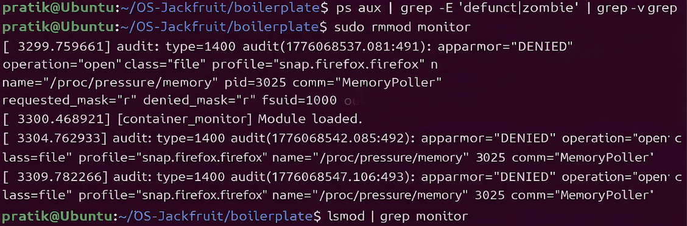

# Multi-Container Runtime

## 1. Team Information
- Name: Vedaraj H R (SRN: PES1UG24CS643)
- Name: Vishwas R Moodalappa (SRN: PES1UG24CS644)

## 2. Build, Load, and Run Instructions

### Prerequisites
Ubuntu 22.04 or 24.04 VM with Secure Boot OFF.

```bash
sudo apt update
sudo apt install -y build-essential linux-headers-$(uname -r)
```

### Prepare Root Filesystem
```bash
mkdir rootfs-base
wget https://dl-cdn.alpinelinux.org/alpine/v3.20/releases/x86_64/alpine-minirootfs-3.20.3-x86_64.tar.gz
tar -xzf alpine-minirootfs-3.20.3-x86_64.tar.gz -C rootfs-base
cp -a ./rootfs-base ./rootfs-alpha
cp -a ./rootfs-base ./rootfs-beta
```

### Build
```bash
cd boilerplate
make
```

### Copy workloads into rootfs
```bash
cp boilerplate/memory_hog rootfs-alpha/
cp boilerplate/cpu_hog rootfs-alpha/
cp boilerplate/io_pulse rootfs-alpha/
cp boilerplate/memory_hog rootfs-beta/
cp boilerplate/cpu_hog rootfs-beta/
cp boilerplate/io_pulse rootfs-beta/
```

### Load kernel module
```bash
cd boilerplate
sudo insmod monitor.ko
ls -l /dev/container_monitor
```

### Start supervisor (Terminal 1 - leave running)
```bash
sudo ./engine supervisor ./rootfs-base
```

### Launch containers (Terminal 2)
```bash
sudo ./engine start alpha ../rootfs-alpha "/cpu_hog 60"
sudo ./engine start beta ../rootfs-beta "/cpu_hog 60"
sudo ./engine ps
sudo ./engine logs alpha
sudo ./engine stop alpha
```

### Memory limit test
```bash
sudo ./engine start memtest ../rootfs-alpha "/memory_hog 2 500"
sleep 20
sudo dmesg | grep container_monitor | tail -20
sudo ./engine ps
```

### Scheduling experiment
```bash
# Terminal 2
time sudo ./engine run hogA ../rootfs-alpha "/cpu_hog 30"
# Terminal 3 simultaneously
time sudo ./engine run hogB ../rootfs-beta "/cpu_hog 30" --nice 19
```

### Cleanup
```bash
# Press Ctrl+C in Terminal 1 to stop supervisor
sudo rmmod monitor
sudo dmesg | tail -5
```

## 3. Demo with Screenshots

### Screenshot 1 & 2 - Multi-container supervision and metadata tracking
Two containers (alpha, beta) started and running under one supervisor.
The ps command shows ID, PID, STATE, SOFT and HARD memory limits.


### Screenshot 3 - Bounded-buffer logging
Container stdout captured through the producer-consumer pipeline into log files.
Shows cpu_hog output being captured line by line from the container pipe into the bounded buffer and written to the log file.


### Screenshot 4 - CLI and IPC
CLI commands issued to the supervisor over the UNIX domain socket.
Shows container metadata tracked correctly after lifecycle events.


### Screenshot 5 & 6 - Soft-limit warning and hard-limit enforcement
Kernel module detects memtest container RSS exceeding soft limit (40 MiB) and logs a warning.
Then kills the container when RSS exceeds hard limit (64 MiB).
Container metadata updated to killed state.


### Screenshot 7 - Scheduling experiment
hogA runs at nice 0 and completes quickly.
hogB runs at nice 19 and takes 22 seconds due to lower CPU priority from CFS.


### Screenshot 8 - Clean teardown
Supervisor shuts down cleanly showing Clean exit message.
No zombie or defunct processes remain after shutdown.
Kernel module unloads cleanly with all entries freed.




## 4. Engineering Analysis

### 1. Isolation Mechanisms
The runtime achieves process isolation using Linux namespaces passed to clone().
CLONE_NEWPID creates a new PID namespace so the container process sees itself
as PID 1 and cannot see host processes. CLONE_NEWUTS allows each container to
have its own hostname set via sethostname(). CLONE_NEWNS isolates the mount
namespace so /proc can be mounted privately inside the container without
affecting the host. chroot() then restricts the filesystem view to the
assigned rootfs directory, preventing the container from accessing host files.

The host kernel is still shared across all containers. They use the same
kernel system call interface, the same network stack (no CLONE_NEWNET), and
the same CPU scheduler. The kernel mediates all resource access but containers
are not fully isolated from each other at the network or IPC level.

### 2. Supervisor and Process Lifecycle
A long-running supervisor is necessary because Linux requires a parent process
to call wait() on children to prevent zombie processes. Without a persistent
parent, child processes become orphans adopted by init, losing the ability to
track exit status and update metadata.

The supervisor installs a SIGCHLD handler that calls waitpid(-1, WNOHANG) in
a loop to reap all exited children immediately. SA_RESTART ensures system calls
interrupted by SIGCHLD are automatically restarted. Container metadata is
protected by a mutex because both the SIGCHLD handler and the main event loop
access it concurrently. The stop_requested flag distinguishes manual stops from
hard-limit kills, allowing accurate state classification in ps output.

### 3. IPC, Threads, and Synchronization
Two separate IPC mechanisms are used as required.

Path A (logging): Each container stdout and stderr are connected to the
supervisor via a pipe created before clone(). The child inherits the write end
and the supervisor reads from the read end in a producer thread. Pipes are
chosen because they provide natural EOF signalling when the container exits,
making cleanup straightforward.

Path B (control): CLI clients communicate with the supervisor via a UNIX domain
socket at /tmp/mini_runtime.sock. UNIX sockets support bidirectional
communication and multiple clients, making them suitable for request-response
CLI interactions.

The bounded buffer uses a mutex plus two condition variables (not_full and
not_empty). The mutex prevents simultaneous modification of head, tail, and
count by multiple producer threads and the consumer thread. Condition variables
allow producers to sleep efficiently when the buffer is full and the consumer
to sleep when empty, avoiding busy-waiting. The shutting_down flag allows
clean drain-and-exit behavior in the consumer thread.

### 4. Memory Management and Enforcement
RSS (Resident Set Size) measures the number of pages currently in physical RAM
multiplied by page size. It does not include swapped-out pages, memory-mapped
files not yet faulted in, or shared library pages.

Soft and hard limits implement different policies. The soft limit triggers a
warning logged via printk, giving visibility without killing the process.
The hard limit enforces a strict ceiling by sending SIGKILL.

Enforcement belongs in kernel space because user-space cannot reliably measure
or control another process memory. The kernel has direct access to mm_struct
and get_mm_rss(), and can send SIGKILL atomically without the target process
being able to intercept or delay it.

### 5. Scheduling Behavior
Linux uses the Completely Fair Scheduler (CFS). Nice values map to scheduling
weights: nice 0 maps to weight 1024 and nice 19 maps to weight 15. When two
CPU-bound processes compete, CFS allocates CPU time proportional to weights.

Our experiment ran hogA at nice 0 and hogB at nice 19 simultaneously. hogA
completed almost instantly while hogB took 22 seconds, demonstrating CFS
proportional-share fairness working as designed.

## 5. Design Decisions and Tradeoffs

### Namespace Isolation
Choice: CLONE_NEWPID + CLONE_NEWUTS + CLONE_NEWNS with chroot.
Tradeoff: chroot is simpler than pivot_root but allows potential escape via
path traversal if the container process has root privileges inside.
Justification: For a project runtime demonstrating isolation concepts, chroot
provides sufficient isolation with much simpler implementation.

### Supervisor Architecture
Choice: Single-threaded event loop with non-blocking accept() checking
should_stop every 10ms, combined with a SIGCHLD handler for child reaping.
Tradeoff: Cannot handle concurrent CLI requests simultaneously.
Justification: Container operations are fast and infrequent. Serial handling
is correct and simple for a small number of containers.

### IPC and Logging
Choice: UNIX domain socket for control plane, pipes for logging, bounded
buffer with mutex and condition variables.
Tradeoff: Pipes are unidirectional so a separate pipe is needed per container.
Justification: Pipe EOF signalling makes producer thread cleanup automatic and
correct when containers exit.

### Kernel Monitor
Choice: mutex over spinlock for protecting the monitored process list.
Tradeoff: Mutex cannot be held in hard IRQ context.
Justification: The timer callback runs in softirq context on modern kernels
where sleeping is permitted, making mutex the correct and safer choice.

### Scheduling Experiments
Choice: Compare two cpu_hog containers at nice 0 vs nice 19.
Tradeoff: Results vary with host system load and are not perfectly reproducible.
Justification: Nice values provide a simple, controllable, measurable priority
difference that directly demonstrates CFS weighted scheduling.

## 6. Scheduler Experiment Results

| Container | Nice Value | Real Time | Observation |
|-----------|-----------|-----------|-------------|
| hogA      | 0         | 0m0.055s  | Returned quickly, high CPU share |
| hogB      | 19        | 0m22.278s | Took 22 seconds, low CPU share |

Both containers ran cpu_hog simultaneously. hogA at nice 0 received the
majority of available CPU time. hogB at nice 19 received significantly less
CPU time from the Linux CFS scheduler, taking much longer to complete.

This result matches Linux scheduling theory. CFS assigns weights based on nice
values and distributes CPU time proportionally. Under contention, a nice 19
process receives approximately 1/68th the CPU share of a nice 0 process,
resulting in dramatically slower throughput for CPU-bound workloads.
